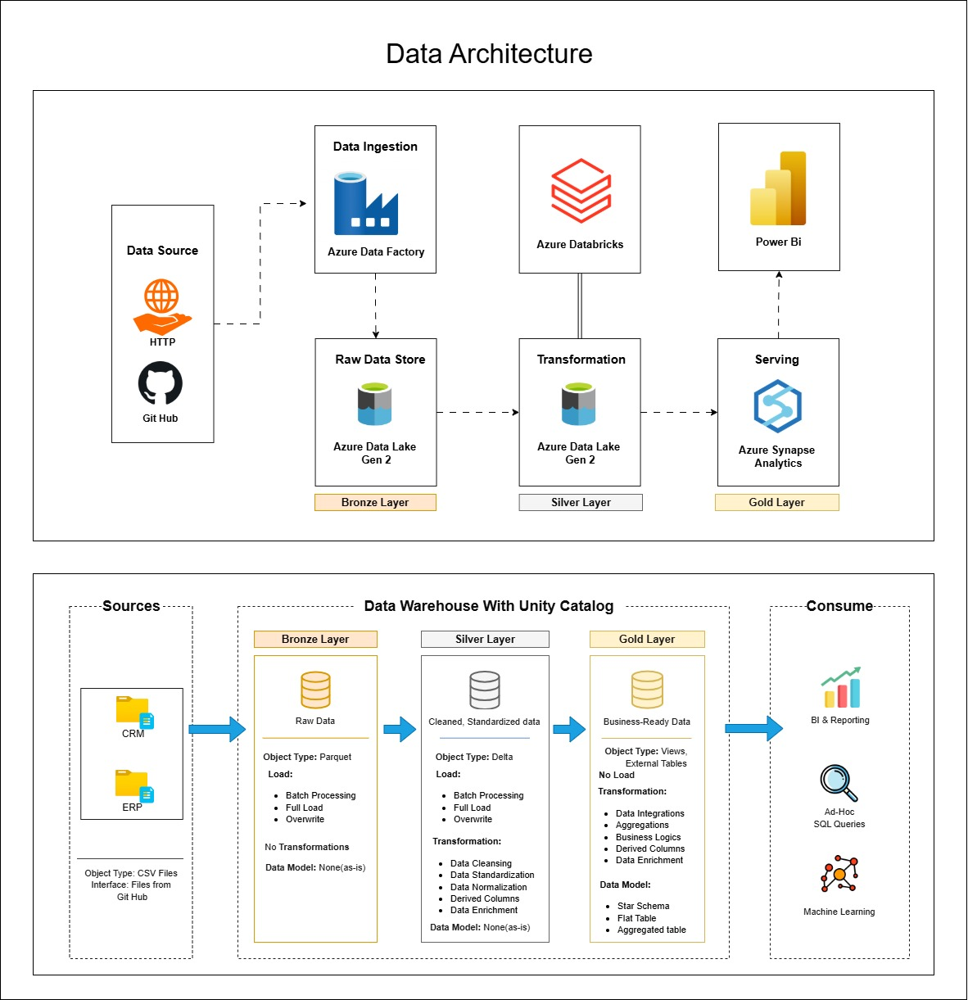

# Data Engineering Azure End-to-End Project

An end-to-end Azure data engineering portfolio project demonstrating how raw CRM and ERP data can be ingested, transformed, modeled, and exposed for analytics using a modern cloud data platform.

## Project Overview

The solution follows a **Medallion Architecture** and uses Azure Data Factory for ingestion, ADLS Gen2 for storage, Azure Databricks/PySpark for transformation, Delta Lake for curated storage, Azure Synapse Analytics for SQL access, and Power BI as the reporting layer.

### Architecture



### Data Flow

```text
CRM / ERP CSV Sources
        |
        v
Azure Data Factory
        |
        v
ADLS Gen2 - Bronze
        |
        v
Azure Databricks + PySpark
        |
        v
ADLS Gen2 / Delta - Silver
        |
        v
Gold Dimensions + Sales Fact
        |
        +------------------+
        |                  |
        v                  v
Azure Synapse         Power BI
```

## Technology Stack

- **Azure Data Factory** — metadata-driven ingestion and pipeline orchestration
- **Azure Data Lake Storage Gen2** — centralized cloud storage
- **Azure Databricks** — PySpark-based transformation and data processing
- **Delta Lake** — reliable curated storage for Silver and Gold layers
- **Unity Catalog** — catalog and schema organization
- **Azure Synapse Analytics** — SQL serving and external access
- **Power BI** — analytics and dashboard layer
- **GitHub** — source control and project versioning

## Medallion Layers

### Bronze

Raw source files are ingested from the repository into ADLS Gen2. The ingestion configuration in `scripts/bronze_layer/filepath.json` maps each source file to its destination folder and Parquet output.

### Silver

The Databricks notebook in `scripts/silver_layer/silver.py` performs cleansing and standardization, including:

- Data type conversion
- Date normalization
- Duplicate handling
- Customer and product standardization
- Gender and marital-status normalization
- Invalid sales/price correction
- Product category normalization
- ERP customer and location cleansing

Curated data is stored as Delta tables in the Silver layer.

### Gold

The Databricks notebook in `scripts/gold_layer/gold.py` creates analytics-ready models:

- `cust_dim` — customer dimension
- `prd_dim` — product dimension
- `sales_fact` — sales fact table

The Gold layer follows a **star-schema approach** with surrogate keys for the main dimensions.


## Repository Structure

```text
Data-Engineering-Azure-End2End-Project/
├── datasets/
│   ├── source_crm/
│   └── source_erp/
├── docs/
│   ├── data_architecture.jpg
│   ├── LINEAGE.jpg
│   ├── Table Integration Model.jpg
│   └── Data Mart Star Schema drawing.jpg
├── scripts/
│   ├── bronze_layer/
│   │   └── ingestion_config
│   ├── silver_layer/
│   │   └── silver.py
│   └── gold_layer/
│       ├── gold.py
│       ├── Create Views Gold.sql
│       └── External Table.sql
├── .gitignore
├── LICENSE
└── README.md
```

## Azure Setup

The notebooks intentionally use `<YOUR_STORAGE_ACCOUNT>` instead of committing a real Azure storage account name or credential.

Before running the notebooks:

1. Create an ADLS Gen2 storage account.
2. Create the `bronze`, `silver`, and `gold` containers.
3. Configure Azure Data Factory with access to the storage account.
4. Configure Databricks access to ADLS Gen2.
5. Replace `STORAGE_ACCOUNT` in the Databricks notebooks with your storage account name, or load it securely from a Databricks secret/configuration.
6. Update `scripts/bronze_layer/filepath.json` if your source repository or branch differs.
7. Configure Synapse managed identity and permissions before running the Synapse SQL scripts.

**Do not commit storage keys, client secrets, database passwords, SAS tokens, or connection strings to GitHub.**

## Portfolio Notes

This repository is maintained as a hands-on Data Engineering portfolio project. The implementation focuses on understanding the complete pipeline lifecycle: ingestion, cloud storage, transformation, data quality, dimensional modeling, SQL serving, and BI consumption.

The project is intended to be explained component-by-component in an interview rather than treated as a black-box template.

## Author

**Abhay Kumar**  
GitHub: [@abhaykr07](https://github.com/abhaykr07)

Repository: [Data-Engineering-Azure-End2End-Project](https://github.com/abhaykr07/Data-Engineering-Azure-End2End-Project)

## License / Attribution

This repository retains the MIT license from the source project used as the starting point for this portfolio adaptation. The original copyright notice is preserved in `LICENSE`.
